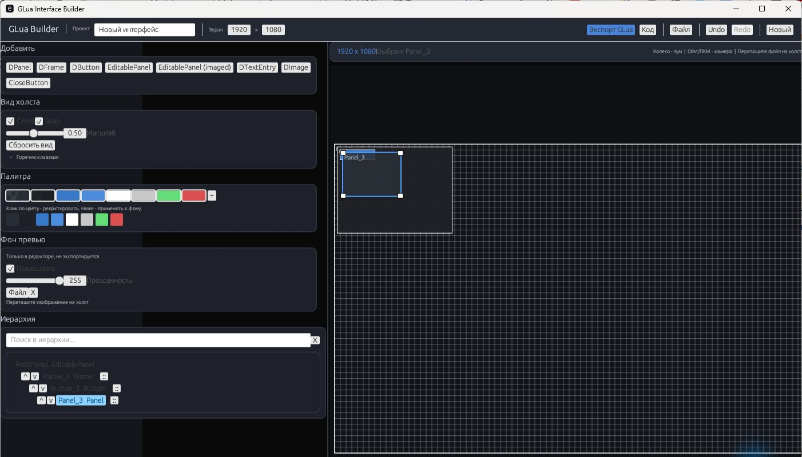

# GLua Interface Builder

Visual editor for building Garry's Mod Derma/VGUI interfaces and exporting them as GLua code.

## Screenshot / Скриншот



## Features

- Canvas-based UI layout editor.
- Element hierarchy with selection, duplication, deletion, and reordering.
- Editable properties for position, size, docking, colors, gradients, images, text layers, and button states.
- GLua export for Derma panels, frames, buttons, text entries, images, and custom paint code.
- Optional DoClick and hover scripts per element.
- JSON project save/load and clipboard export.

## Getting Started

Requirements:

- Rust stable toolchain.

Run the editor:

```sh
cargo run
```

Run tests:

```sh
cargo test
```

## Export Flow

1. Create or edit the interface on the canvas.
2. Configure elements in the properties panel.
3. Use the code preview to inspect generated GLua.
4. Export GLua to the clipboard and paste it into your Garry's Mod addon or gamemode.

Local image files are used for editor preview. The exported GLua uses material paths, so copy the assets into your addon and keep the material paths valid for Garry's Mod.

## Project Files

Projects can be saved as JSON and loaded later from disk or clipboard. The JSON stores the layout, element tree, visual settings, image material paths, and custom script snippets.

---

# GLua Interface Builder

Визуальный редактор для сборки интерфейсов Garry's Mod Derma/VGUI с экспортом в GLua-код.

## Возможности

- Редактор интерфейса на холсте.
- Иерархия элементов с выбором, дублированием, удалением и изменением порядка.
- Настройки позиции, размера, docking, цветов, градиентов, изображений, текстовых слоев и состояний кнопок.
- Экспорт GLua для Derma-панелей, фреймов, кнопок, текстовых полей, изображений и кастомного Paint-кода.
- Скрипты DoClick и hover для отдельных элементов.
- Сохранение и загрузка проекта в JSON, экспорт через буфер обмена.

## Быстрый старт

Требования:

- Стабильный Rust toolchain.

Запуск редактора:

```sh
cargo run
```

Запуск тестов:

```sh
cargo test
```

## Экспорт

1. Создайте или отредактируйте интерфейс на холсте.
2. Настройте элементы в панели свойств.
3. Откройте предпросмотр кода и проверьте сгенерированный GLua.
4. Экспортируйте GLua в буфер обмена и вставьте код в addon или gamemode Garry's Mod.

Локальные изображения используются для предпросмотра в редакторе. В экспортируемом GLua используются material paths, поэтому ассеты нужно положить в addon и сохранить корректные пути материалов для Garry's Mod.

## Файлы проекта

Проекты сохраняются в JSON и могут загружаться с диска или из буфера обмена. JSON хранит layout, дерево элементов, визуальные настройки, пути материалов изображений и пользовательские скрипты.
